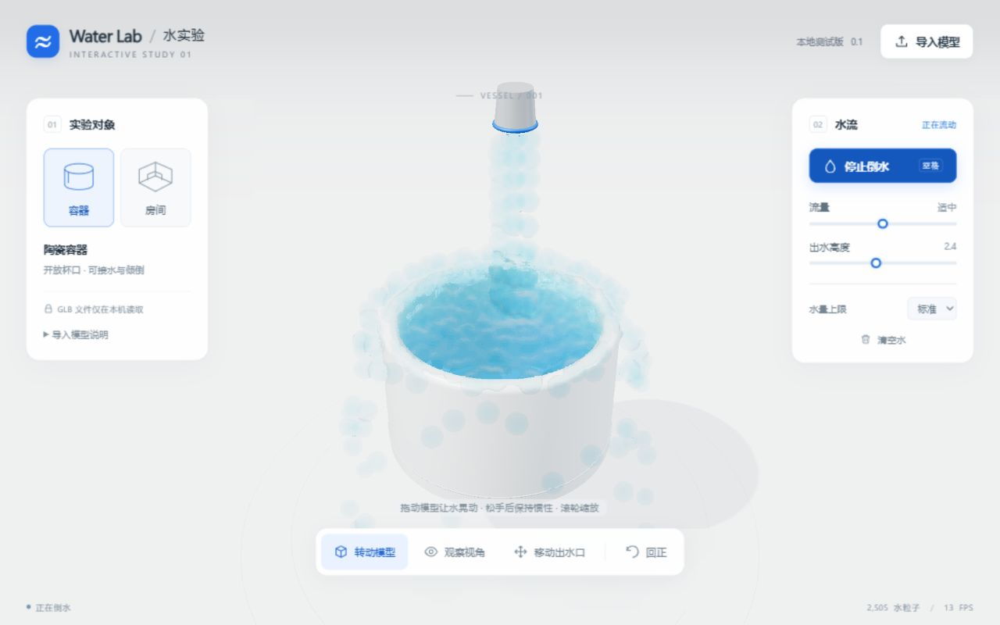
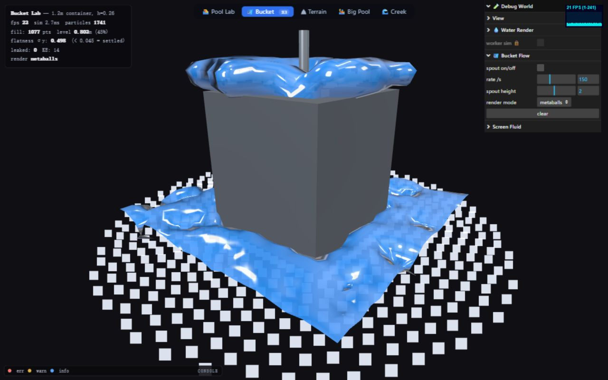
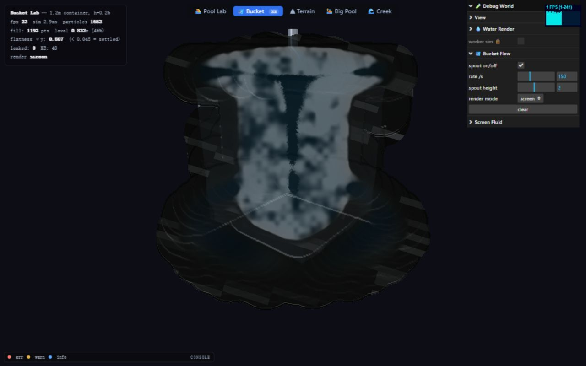
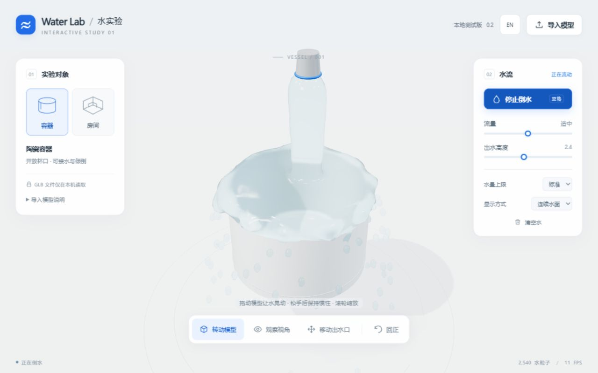
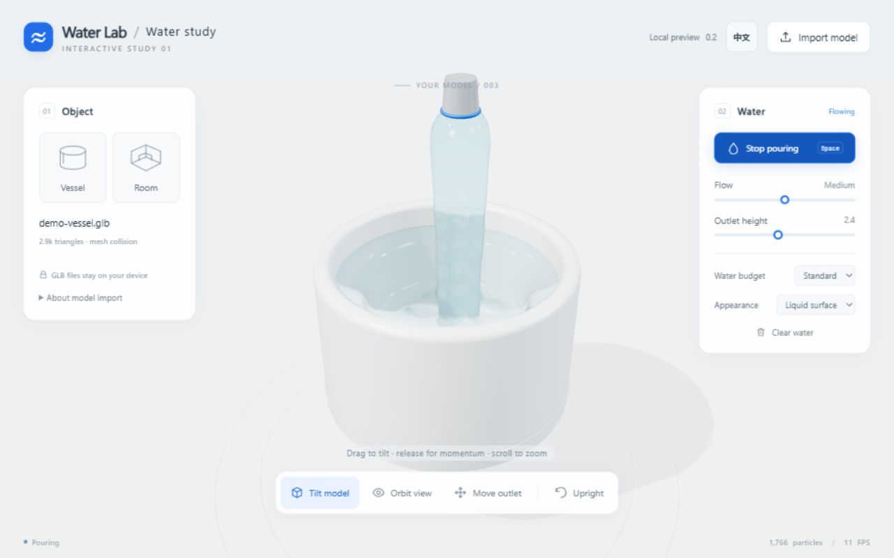

# Water Lab 0.2 — 对比与整合记录

2026-09-22，本地 Windows / Codex 内置浏览器；桌面对照窗口 1280 × 800。没有上传或发布网站。

## 实际运行了什么

1. 原来的 Water Lab 0.1：内置容器，持续倒水。
2. [threejs-water-sim](https://github.com/RasputinKaiser/threejs-water-sim)，提交 `6f66040d77070cbcef701b4b02874fa5c4772e21`：`bucket.html`，分别切换 metaballs 和 screen 模式。通过界面把流量设为 150；URL 的 `pour=150` 在这个入口只开启倒水，不会自动把默认流量 60 改为 150。
3. 优化后的 Water Lab 0.2：连续水面、粒子对照、内置容器、房间及实际导入的 `demo-vessel.glb`。

这些场景的容器尺寸、碰撞形状、粒子数量和相机不同，因此截图用于比较外观和功能，**不是严格的同负载 FPS 排名**。后台标签页和应用窗口切换也会影响帧率，未据此宣称某版本快多少倍。

## 观察与决定

| 版本 / 模式 | 本机观察 | 整合决定 |
|---|---|---|
| Water Lab 0.1 | 水流有明显球形颗粒，深度平滑无法填补颗粒间的空隙；有导入模型和旋转碰撞 | 保留模型导入、碰撞、重力、旋转惯性和出水口控制 |
| 原版 metaballs | 相邻样本能形成连贯的表面，蓝色高光较强；水桶为固定场景 | 采用重建融合表面的路线，接入同一个 Three.js MarchingCubes 组件 |
| 原版 screen | 本机切换后出现异常暗色覆盖及遮挡；该观察仅针对本次运行，不代表所有设备 | 不直接移植该渲染管线 |
| Water Lab 0.2 | 连续水柱、连贯积水和细小飞溅；透明折射取代厚重蓝色球体；保留导入与旋转 | 作为本次优化版的默认效果 |

## 具体采用了哪些内容

- 实际使用 Three.js 官方 **MarchingCubes**（r180 / MIT），这也是原版融合表面的底层组件。
- 本项目独立实现高斯密度场，以三线性质量投放和滑动窗口滤波重建表面；避免每个粒子都重复计算大量邻近网格。
- 水面范围跟随主要水体；远处流走的水以小水滴显示，避免单个远处粒子让整个水面变粗。
- 快速水流使用沿速度方向的质量采样；透明材质采用折射、菲涅耳反射和吸收。表面绘制不改变模拟位置。
- 保留原有的移动网格 BVH 碰撞与模拟器。**没有复制原版仓库的自定义求解器或 surface.js / screen-fluid.js 源码**；也没有把固定水桶伪装成可导入任意模型的完整系统。
- 添加 EN / 中文切换，覆盖界面、动态状态、导入提示与错误；语言选择本机保存，切换不重置实验。

## 检查结果

9 项自动检查通过：容器储水与倒空、房间门洞、导入网格薄壁与内腔、输入/水量限制、持续注水、旋转网格倒水、表面生成不修改物理数据/清空不残留、水柱样本连接、中英动态文本。

浏览器实际检查：开关水、拖动模型、移动出水口、GLB 文件选择与导入、无效 GLB 英文报错、粒子/水面切换、中英切换及刷新后的语言记忆。390px 窗口无横向溢出；手机设备性能尚未验证。

独立 CPU 表面生成基准：固定 1,974 个样本，56³ 网格，预热后一次运行中位数约 8.5 ms、最高约 10.1 ms。可运行 `node --import ./tests/register.mjs tests/surface-bench.mjs` 复测。这仅包含表面生成，**不包含物理、显卡渲染，也不等于网页帧率**。

## 仍然存在的限制

实时近似水体，尚非工程级流体。薄膜、微小飞沫和泡沫没有精确求解；密度场可能把极近的水团融合，水面体积与真实升数未标定。复杂或破损扫描模型仍可能漏水；没有自动补洞。还需要用户自己的扫描模型做下一轮验证。

## 实际截图

### 旧版球状水流

### 原版融合表面

### 原版 screen 模式在本机的异常

### 优化版

### 导入 GLB 后的优化版

